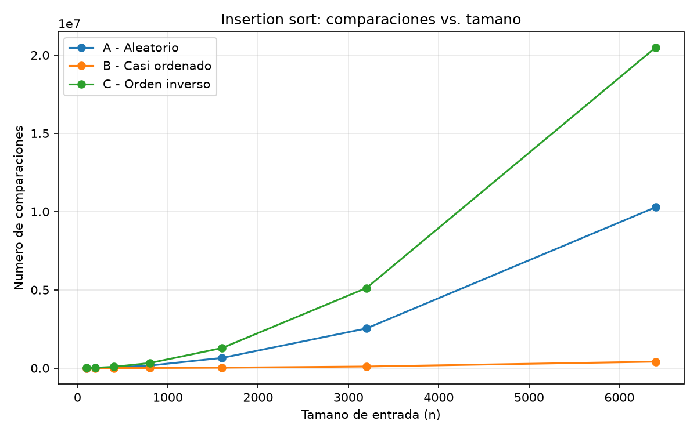
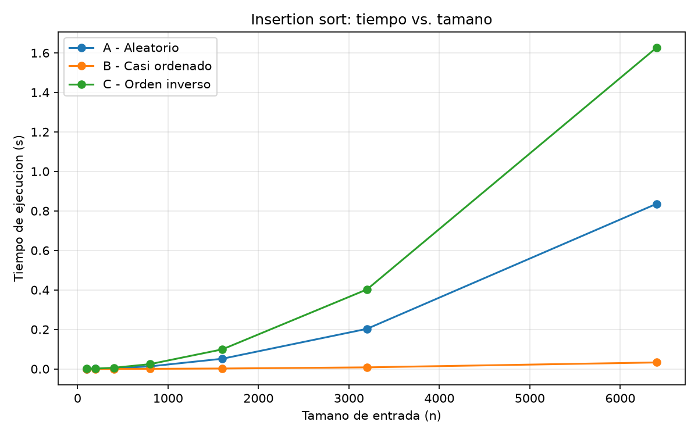

## Parte 1 — Analizar el algoritmo antes de comprar hardware
La Secretaría debería analizar primero el algoritmo antes de comprar un servidor más rápido, porque el algoritmo entrega el resultado correcto y ha funcionado por más de ocho años, pero al aumentar la cantidad de registros de 20.000 a 1.200.000 significaría que el algoritmo no funcionaría en el tiempo que el sistema necesita. En el caso de Tamiza, el insertion sort es correcto porque logra ordenar los registros por índice de riesgo y genera la lista que se necesita. El problema es que no alcanza a terminar de ordenar los 1.200.000 registros dentro de la ventana de cuatro horas, entre las 2:00 a. m. y las 6:00 a. m. Por lo tanto, el problema no es que el resultado sea incorrecto, sino que el algoritmo no cumple con la restricción de tiempo que tiene el sistema.

Duplicar la velocidad del servidor podría hacer que el proceso tarde menos, pero no solucionaría el problema de fondo. El insertion sort necesita hacer muchas más comparaciones que antes, ya que los registros aumentaron 60 veces más, en este caso se está trabajando con 1.200.000 registros, los registros aumentaron 60 veces y el trabajo crece con el cuadrado de los datos, es decir, unas 3.600 veces, por lo que el problema está principalmente en la forma en que trabaja el algoritmo y no solamente en la velocidad del computador. Si en el futuro la cantidad de registros sigue aumentando, probablemente el problema volverá a aparecer aunque se compre un servidor más potente.

Un ejemplo diferente y que pude programar alguna vez, es una tienda en línea que tiene que ordenar los precios de unos 500.000 productos para mostrarlos a los usuarios. En Python y utilizando insertion sort, este proceso de ordenamiento puede tardar más de 30 segundos, el algoritmo podría ordenar correctamente los productos, pero tardaría demasiado tiempo si la página necesita mostrar los resultados en menos de 2 segundos. el algoritmo sería correcto, pero no serviría para cumplir con la necesidad de la aplicación. En este caso, la restricción que se estaría incumpliendo sería el tiempo máximo de respuesta.

Por esto, antes de comprar un servidor más rápido, se debería revisar el algoritmo que está utilizando Tamiza y analizar si puede manejar correctamente la cantidad de datos actuales. Que un algoritmo sea correcto solo garantiza que entrega el resultado esperado, mientras que analizar su complejidad permite saber si puede hacerlo en el tiempo que necesita el sistema.

## Parte 2 — Responsabilidad ambiental y ética de la implementación
Desde el punto de vista ambiental, el tiempo que permanece trabajando el servidor se relaciona directamente con su consumo de energía. La relación básica es energía = potencia × tiempo. Por ejemplo, si suponemos que el servidor consume en promedio 500 W, trabajar durante 4 horas representaría aproximadamente 2 kWh. Si esto ocurre todas las madrugadas, serían unos 730 kWh al año. Además, si un algoritmo necesita más tiempo de procesamiento que otro para realizar el mismo trabajo, también mantiene el servidor funcionando durante más tiempo y genera un consumo adicional. Por eso, utilizar un algoritmo que pueda resolver el problema con menos trabajo puede ayudar a reducir el uso innecesario de energía.

En la parte ética, como un fallo del proceso puede afectar a una persona concreta, si pensamos en un paciente con un índice de riesgo cercano a 1000 e insertion sort todavía no ha terminado a las 6:00 a. m., el algoritmo sigue siendo correcto, pero Tamiza estaría utilizando un resultado incompleto. Ese paciente podría quedar fuera de la lista de llamadas de ese día y retrasarse su valoración médica. El costo lo asume principalmente el paciente y, y yo como responsable técnico, asumiría la responsabilidad de haber permitido que se utilizara una lista que todavía no estaba completa.

Otro caso afecta al operador del centro de contacto. Si recibe una lista parcial, puede realizar llamadas a pacientes de menor riesgo mientras existen pacientes de mayor riesgo que todavía no aparecen. Aunque esté siguiendo las instrucciones del sistema, no es debido trabajar con información en la que no puede confiar completamente. En este caso, el operador asume ese riesgo, mientras que el problema técnico está relacionado con la decisión de utilizar un proceso que no garantiza una lista completa antes de comenzar las llamadas.

También existe una obligación adicional sobre la corrección del ordenamiento en Tamiza, el orden representa una prioridad de atención, por lo que un error podría hacer que un paciente con mayor riesgo sea contactado después que otro con menor riesgo. Además, pueden existir muchos empates porque los índices van de 0 a 1000. Tanto insertion sort como merge sort pueden conservar el orden anterior de los registros con el mismo índice si se implementan de forma estable.

## Parte 3 — Peor caso, mejor caso y caso promedio, demostrados en Python

### 3.1 Explicación

- **Peor caso:** se toma el máximo de T(I) sobre todas las entradas de tamaño n. Es una cota superior: ningún lote de ese tamaño puede costar más. En insertion sort (orden de mayor a menor) se alcanza cuando el lote llega en el orden contrario al que se busca (de menor a mayor): cada elemento nuevo recorre todo el prefijo ya ordenado, lo que da n(n−1)/2 comparaciones, es decir, O(n²).
- **Mejor caso:** se toma el mínimo de T(I) sobre las mismas entradas de tamaño n. Es una cota inferior. En insertion sort se alcanza cuando el lote ya viene en el orden de salida (de mayor a menor): cada elemento se compara una sola vez y se queda en su lugar, con n−1 comparaciones, es decir, O(n).
- **Caso promedio:** se toma el promedio de T(I) sobre las mismas n! entradas de tamaño n, suponiendo que todos los órdenes iniciales son igualmente probables. En insertion sort cada elemento recorre en promedio la mitad del prefijo ya ordenado, lo que da cerca de n²/4 comparaciones, es decir, O(n²).

**¿Cuál usaría para decidir si Tamiza entra en producción?** Yo usaría el peor caso. La ventana de cuatro horas es estricta: si un solo lote la excede, el proceso falla, y no importa que la mayoría de los días sí quepa. Con una restricción así, lo que hay que garantizar es que incluso el lote más desfavorable de tamaño n termine dentro de la ventana, y solo el peor caso es una cota que ningún lote de ese tamaño puede superar.

**Predicción antes de medir**
- **Peor caso para insertion sort: escenario C (orden inverso)** porque el algoritmo ordena de mayor a menor y ese lote llega de menor a mayor. Cada elemento nuevo es mayor que todos los anteriores, así que se desplaza hasta el inicio y se hacen n(n−1)/2 comparaciones.
- **Mejor caso: escenario B (casi ordenado)** porque el 98% del lote ya está en el orden de salida y esos elementos casi no se desplazan. Solo el 2% del final necesita moverse. (El mejor caso teórico puro sería un lote 100% ordenado, con n−1 comparaciones, que no está entre los tres escenarios; B es el más cercano.)
- **Caso promedio: escenario A (aleatorio)** porque un orden aleatorio es una muestra típica de todas las permutaciones posibles, así que cada elemento recorre en promedio la mitad del prefijo, con cerca de n²/4 comparaciones.

### 3.2 Demostración experimental

**Cómo se hizo:** se ejecutó `parte3_casos.py`, que corre `insertion_sort` sobre los tres escenarios con tamaños n = 100, 200, 400, 800, 1600, 3200 y 6400. Los escenarios A y B usan la semilla 42 para que el experimento sea reproducible; C no usa aleatoriedad. El B se genera con el 98 % del lote en el orden de salida (la lista de ayer) y un 2 % de valores al azar anexado al final (los resultados nuevos del día). Se cronometró únicamente la llamada al algoritmo con `time.perf_counter()`; la generación de los datos y las verificaciones de correctitud (resultado ordenado y sin registros perdidos) quedan fuera del cronómetro. Las comparaciones las cuenta el propio algoritmo, por lo que son exactas y reproducibles; los tiempos dependen de la máquina y pueden variar entre ejecuciones.

| n | Comparaciones A (aleatorio) | Comparaciones B (casi ordenado) | Comparaciones C (inverso) |
|---|---|---|---|
| 100 | 2.542 | 193 | 4.950 |
| 200 | 9.970 | 582 | 19.900 |
| 400 | 40.436 | 1.607 | 79.800 |
| 800 | 160.484 | 7.185 | 319.600 |
| 1600 | 648.481 | 25.834 | 1.279.200 |
| 3200 | 2.533.103 | 98.707 | 5.118.400 |
| 6400 | 10.276.753 | 409.342 | 20.476.800 |

Tiempos medidos (segundos), como referencia:

| n | Tiempo A | Tiempo B | Tiempo C |
|---|---|---|---|
| 100 | 0,00019 | 0,00001 | 0,00026 |
| 200 | 0,00053 | 0,00003 | 0,00113 |
| 400 | 0,00223 | 0,00010 | 0,00437 |
| 800 | 0,01014 | 0,00050 | 0,01945 |
| 1600 | 0,04344 | 0,00183 | 0,08597 |
| 3200 | 0,17429 | 0,00682 | 0,34479 |
| 6400 | 0,71617 | 0,02893 | 1,42986 |

**Resultados**
- **Peor caso: escenario C.** Es el que más comparaciones tiene y más tiempo consume en todos los tamaños. Sus comparaciones coinciden exactamente con n(n−1)/2. Al duplicar n, las comparaciones y el tiempo se multiplican por 4, lo que confirma un crecimiento cuadrático O(n²).
- **Mejor caso: escenario B.** Es el que menos comparaciones tiene y menos tiempo necesita: con n = 6400 hace unas 50 veces menos comparaciones que C y tarda 0,029 s frente a 1,43 s. Aun así, no crece de forma lineal en este rango: al duplicar n las comparaciones se multiplican por cerca de 4.
- **Se aproxima al caso promedio: escenario A.** Con n = 6400 hace 10.276.753 comparaciones, muy cerca de n²/4 = 10.240.000, y aproximadamente la mitad de las de C en todos los tamaños. Y también crece cuadráticamente.

**Contraste con la predicción:** Los resultados coinciden con lo esperado: C es el peor, B el mejor y A queda en un punto intermedio. Sin embargo, B no alcanza el mejor caso teórico, que ocurre cuando los datos están completamente ordenados, porque ese 2 % de elementos desordenados aumenta junto con el tamaño de la entrada. Por eso, B sigue teniendo un crecimiento cuadrático, aunque con un costo mucho menor que C. Esto muestra que insertion sort funciona muy bien con datos casi ordenados, pero su peor caso sigue aumentando de forma cuadrática. Finalmente, A representa una muestra del caso promedio, aunque no el promedio exacto, porque solo se utilizó una semilla.